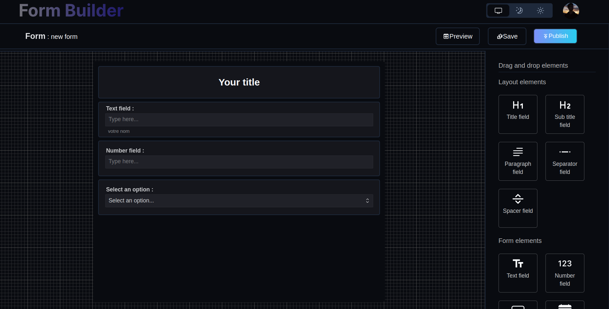
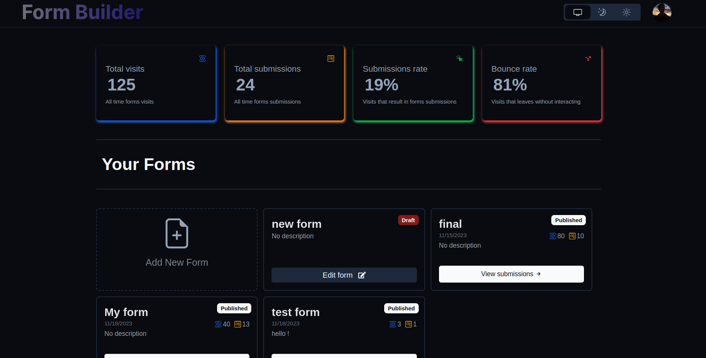
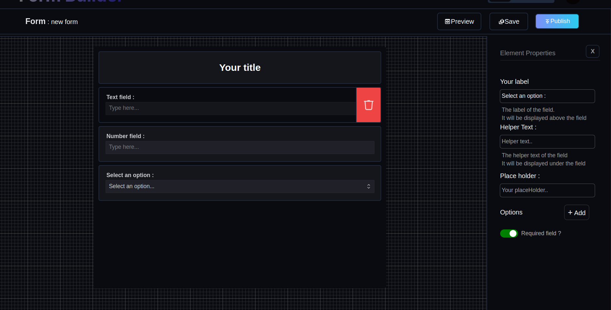
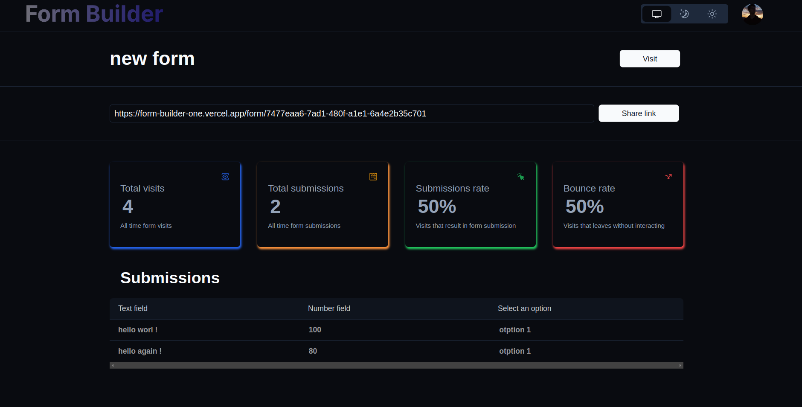

 

  

  <h3 align="center">Form Builder</h3>

  

    Form Your Vision, Build with Precision!
     
    <a href="https://github.com/benAzouzYassin/Form-Builder"><strong>Explore the repository »</strong></a>
     
     
    <a href="https://github.com/benAzouzYassin/Form-Builder">View Code</a>
    ·
    <a href="https://github.com/benAzouzYassin/Form-Builder/issues">Report Bug</a>
    ·
    <a href="https://github.com/benAzouzYassin/Form-Builder/issues">Request Feature</a>
  

<!-- TABLE OF CONTENTS -->
## Table of contents

  
Content

  <ol>
    <li>
      <a href="#about-the-project">About The Project</a>
      <ul>
        <li><a href="#built-with">Built With</a></li>
      </ul>
    </li>
    <li><a href="#usage">Usage</a></li>
    <li><a href="#pages">Pages</a></li>
    <li><a href="#contributing">Contributing</a></li>
    <li><a href="#license">License</a></li>
    <li><a href="#contact">Contact</a></li>
  </ol>

<!-- ABOUT THE PROJECT -->
## About The Project

    

<b>Form-Builder</b> is an open-source platform built using NextJs 13. The goal from our platform is to simplify the process of creating good looking forms.
The app provide the user with fully customizable draggable components to build his wished UI.
You can support the development of Form-Builder! 🌟

### Features

* Very clean and modern interface with easy user experience.
* Easy and fast way for crating forms.
* User friendly dashboard for visualizing form submissions.

### Built With

* [NextJs](https://en.wikipedia.org/wiki/Next.js)
* [Typescript](https://en.wikipedia.org/wiki/TypeScript)
* [Tailwind css](https://en.wikipedia.org/wiki/Tailwind_CSS)

## Usage
1. Go to https://form-builder-one.vercel.app/.
2. Authenticate yourself (SingUp Or SignIn)
3. Build your form ! :)

<!-- ROADMAP -->
## Pages

### Dashboard Page :

    

### Builder Page (***Element setting is open***):

    

### Submissions Page  :

    

<!-- CONTRIBUTING -->
## Contributing

Contributions are what make the open source community such an amazing place to be learn, inspire, and create. Any contributions you make are **greatly appreciated**.

1. Fork the Project
2. Create your Feature Branch (`git checkout -b feature/AmazingFeature`)
3. Commit your Changes (`git commit -m 'Add some AmazingFeature'`)
4. Push to the Branch (`git push origin feature/AmazingFeature`)
5. Open a Pull Request

<!-- LICENSE -->
## License

Distributed under the MIT License. See `LICENSE` for more information.

<!-- CONTACT -->
## Contact

Yassine ben azouz - [@Yassine ben azouz](https://www.linkedin.com/in/yassine-ben-azouz-724782242/) - yassinebenazouz123@gmail.com

Live Demo - [https://form-builder-one.vercel.app/](https://form-builder-one.vercel.app/)

Source Code: [https://github.com/benAzouzYassin/Form-Builder](https://github.com/benAzouzYassin/Form-Builder)
